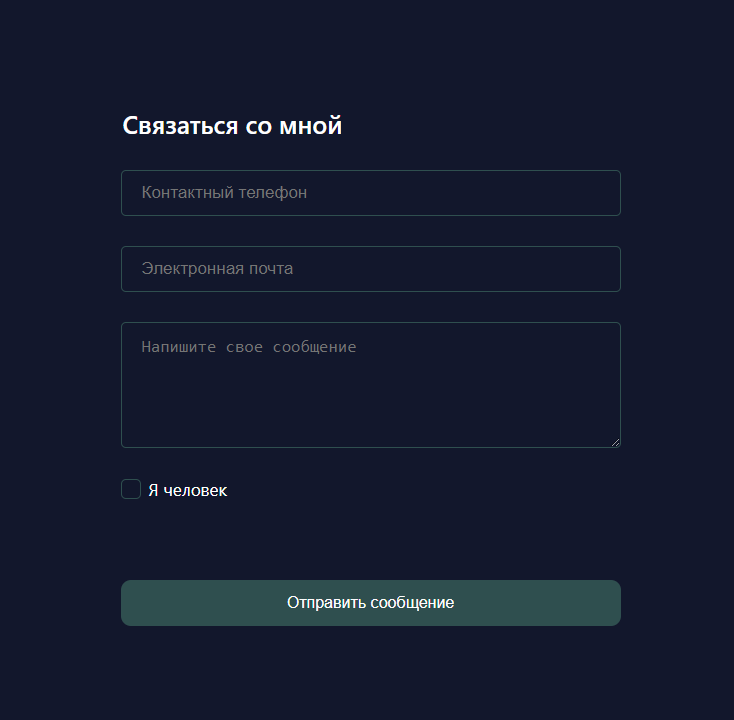

# Форма обратной связи

Небольшая форма обратной связи для отправки собщений с сайта в телеграм-группу или в телеграм-бота.
В зависимости от выбраного id чата можно настроить получение ссобщений в группу от лица бота, либо, присылать сообщения напрямую боту.

## Суть и структура проекта:
Этот проект изначально задумывался как мини-библиотека реакт-компонентов для более быстрого создания собственных приложений. Поэтому папка components переодически пополняется новыми компонентами, не используемыми в данном проекте. 
Для работы с формами используется библиотека React Hook Form. 
Приложение написано на Next.js
Интерес самой формы заключается в том, что, с помощью next-server и next api можно отпраить сообщение с сайта в телеграм, не выствив при этом напоказ конфиденциальную информацию - токен бота и id чата. Все происходит 'под капотом'.

## Настройка и использование формы
Для того чтобы интегрировать форму в свой проект необходимо сделать следующее:
  - Токен и id чата хранятся в переменных окружения, поэтому для работы приложения создадим файл .env,
  в который позже сохраним необходимые нам переменные. 
  - Создадим самого простого телеграм-бота использую @BotFather (главный телеграм бот по созданию ботов =) ). Нужно найти его как обычного пользователя и далле следовать инструкциям этого бота. 
  - При создании бота нам выдадут его токен. Берем его и сохраняем в переменную <code>NEXT_PUBLIC_BOT_TOKEN</code>.
  - Для получения сообщений от лица бота в группу:
    1. Создаем группу и приглашаем туда нашего бота по нику.
    2. Пишем боту команду /join @Название чата
    3. В адресной строке браузера пишем https://api.telegram.org/botХХХХХХХ/getUpdates,
      где ХХХХХХ меняем на токен бота, полученный раннее. Если все сделали правильно, то увидим на странице объект, в котором нас интересует поле <code>"chat"</code>. Забираем id и сохраняем его в переменную <code>NEXT_PUBLIC_CHAT_ID</code>.
  - Для получения сообщений непосредственно в бота:
    1. Пишем боту команду /join @Ваш ник-нейм
    2. Выполняем пункт 3, описаный выше.
  После этих шагов форма готова к использованию.

## Технологии:

* React
* Next.js
* TypeScript
* React Hook Form

### Автор
* Колосов Андрей [&rsaquo; GitHub &lsaquo;](https://github.com/AndreiKolosov)